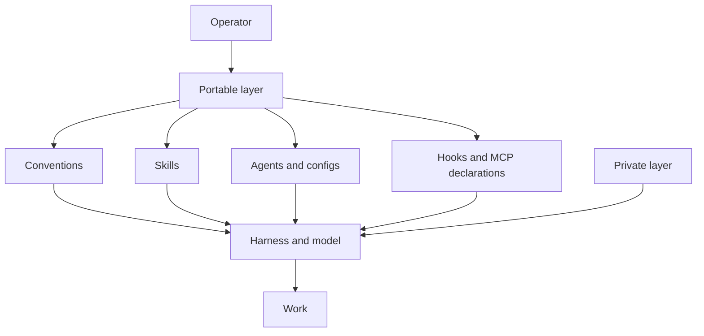

# agents-cfg

**I built this for one operator, me.** This repository keeps my working method for Claude Code and
Codex in files I can read, review, and carry between machines. If some of it fits you, take it and
change the rest.

**My bet is thin harness, fat skills.** If you squint, the harness and its model look like a base
model. The machine-learning language is an analogy. I keep the weights frozen and overfit the
context to my work while the harness teams optimise for general use.

**I need to stay in the thinking loop.** Agents move fast, and accepting each plausible edit is the
easy path. The conventions, checks, and independent review lanes make me examine the work while the
tooling handles the repetition.

## install

```bash
git clone https://github.com/ivankqw/agents-cfg.git ~/agents-cfg
~/agents-cfg/bootstrap.sh
```

## get started

1. [Install the setup and run the harness canaries](docs/INSTALL.md).
2. [Choose a model config for the harness that owns the session](configs/README.md).
3. [Give the agent an issue and choose a pstack workflow](docs/HOW-IT-WORKS.md).

## the stack

| principle | layer | tool | fixed or flexible | where configured |
|---|---|---|---|---|
| Use a strong base | Harness | Claude Code, Codex; Hermes is experimental `[unverified]` | Flexible | [`configs/`](configs/), [`settings/`](settings/), or the private layer |
| Keep execution visible | Tracker and execution | Linear | Flexible | [`mcp/servers.json`](mcp/servers.json) and the private layer |
| Carry one tool catalog | Agent-connection portability | Executor Cloud through MCP | Flexible | [`mcp/servers.json`](mcp/servers.json) |
| Keep agents in view | Agent runtime | Herdr | Flexible | Private layer |
| Load the method on demand | Skills | pstack and Matt Pocock's skills | Flexible, with pinned sources | [`pstack-revision.txt`](pstack-revision.txt) and [`bootstrap.sh`](bootstrap.sh) |
| Isolate each checkout | Worktrees | `wt` and treehouse; `pnpm` or `uv` per project | Flexible per project | Private layer |
| Change the blind spots | Review independence | Different vendor first; different model fallback | Fixed independence rule | [`conventions/AGENTS.md`](conventions/AGENTS.md) and [`configs/`](configs/) |
| Spend context on defaults | Conventions | Always loaded `[unverified]` and under 200 lines `[sourced: MAINTAINING.md]` | Fixed rule | [`conventions/AGENTS.md`](conventions/AGENTS.md) and [`install.sh`](install.sh) |



## usage

I run these from my full machine setup. The portable bootstrap does not install the Herdr or
[backpass](https://github.com/kunchenguid/backpass) runtimes. `[sourced: bootstrap.sh]`

```text
herdr agent prompt codex "Take this lane's issue brief. Use the implement skill, then open a draft PR." --wait
```

```text
/code-review origin/main
```

```bash
backpass scan --since 7d --strict
backpass
```

## skills

I write a skill when no upstream skill covers the job.

<details>
<summary>Skills I own</summary>

| skill | job |
|---|---|
| [`cleanup-crew`](skills/cleanup-crew/SKILL.md) | Keep the issue tracker aligned with current work. |
| [`dogfood-local`](skills/dogfood-local/SKILL.md) | Run a local app and verify the real user path. |

</details>

<details>
<summary>Upstream skills by source</summary>

| source and credit | skills |
|---|---|
| [pstack by Lauren "poteto" Tan, contributors, and Michael Denyer's Claude port](https://github.com/michael-denyer/pstack-claude) | Routing, review, verification, agent workflows, and engineering principles. |
| [Herdr](https://github.com/herdrdev/herdr) | `herdr`. |
| [Matt Pocock](https://github.com/mattpocock/skills) | `ask-matt`, `code-review`, `codebase-design`, `diagnosing-bugs`, `domain-modeling`, `grill-me`, `grill-with-docs`, `grilling`, `handoff`, `implement`, `improve-codebase-architecture`, `prototype`, `research`, `resolving-merge-conflicts`, `setup-matt-pocock-skills`, `tdd`, `teach`, `to-questionnaire`, `to-spec`, `to-tickets`, `triage`, `wait-what`, `wayfinder`, `wizard`, `writing-for-agents`. |
| [Vercel Labs](https://github.com/vercel-labs/skills) | `find-skills`. |
| [Cursor](https://github.com/cursor/plugins) | `deslop`. |
| [Hardik Pandya](https://github.com/hardikpandya/stop-slop) | `stop-slop`. |
| [Microsoft](https://github.com/microsoft/azure-skills) | `microsoft-foundry`. |
| [shadcn](https://github.com/shadcn/improve) | `improve`. |
| [Leon](https://github.com/Leonxlnx/taste-skill) | `brandkit`, `design-taste-frontend`, `high-end-visual-design`, `imagegen-frontend-mobile`, `imagegen-frontend-web`, `image-to-code`, `redesign-existing-projects`. |
| [Peter Bakaus](https://github.com/pbakaus/impeccable) | `impeccable`. |
| [Aiden Bai](https://github.com/aidenybai/react-doctor) | `improve-react`. |
| [Saurabh Kumar](https://github.com/saurabhkumar8112/cyclomatic-complexity-skill) | `cyclomatic-complexity`. |
| [Dietrich Gebert](https://github.com/DietrichGebert/ponytail) | `ponytail-audit`, `ponytail-debt`, `ponytail-gain`, `ponytail-help`, `ponytail-review`. |

</details>

## docs

- [Thesis](docs/THESIS.md) explains the personal overfitting argument.
- [How it works](docs/HOW-IT-WORKS.md) explains each layer and its source file.
- [Install](docs/INSTALL.md) installs, verifies, updates, and removes the setup.
- [Credits](docs/CREDITS.md) names upstream authors, sources, and licenses.
- [Maintaining](MAINTAINING.md) gives repository editing and verification rules.

Fork this setup and overfit it to yourself. Keep what fits your work and replace my assumptions with
yours.

The repository uses the MIT License. See [LICENSE](LICENSE). `NOTICE` records adapted material.
