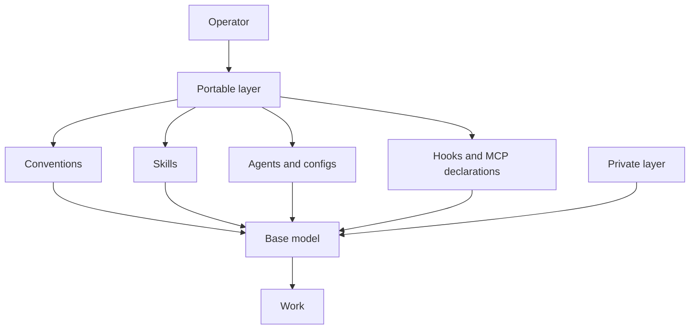

# agents-cfg

I treat Claude Code or Codex with its model as a base model. I overfit the context to my work
with conventions, skills, agents, configs, and hooks. The harness stays thin. The skills carry the
procedures, examples, and failure stories that make the agent work the way I work.

Read the documentation by purpose:

- [Thesis](docs/THESIS.md) explains the personal overfitting argument.
- [How it works](docs/HOW-IT-WORKS.md) explains each layer and its source file.
- [Install](docs/INSTALL.md) installs, verifies, updates, and removes the setup.
- [Skill sync](docs/SYNC.md) explains lockfile drift and the catalog workflow.
- [Glossary](docs/GLOSSARY.md) defines the shared terms.
- [Credits](docs/CREDITS.md) names upstream authors, sources, and licenses.
- [Maintaining](MAINTAINING.md) gives repository editing and verification rules.

The repository uses the MIT License. See [LICENSE](LICENSE). `NOTICE` records adapted material.
