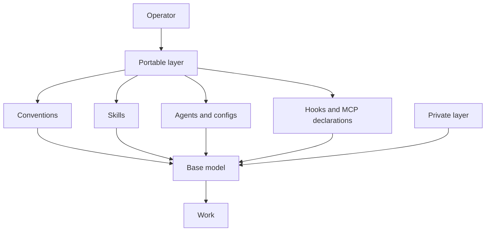

# agents-cfg

If you squint, Claude Code or Codex with its model looks like a base model. I keep the weights frozen
and pile my own context on top. The machine-learning language is an analogy. It captures why I keep
conventions, skills, agents, configs, and hooks in one place. I am trying to overfit the agent
to one operator, me.

The harness stays thin, and the skills get fat. They carry the procedures, field-shot examples, and
failure stories that teach an agent how I work at inference time. The harness teams can optimise
for general use. I can accept the maintenance cost of fitting the context to myself.

Read the documentation by purpose:

- [Thesis](docs/THESIS.md) explains the personal overfitting argument.
- [How it works](docs/HOW-IT-WORKS.md) explains each layer and its source file.
- [Install](docs/INSTALL.md) installs, verifies, updates, and removes the setup.
- [Credits](docs/CREDITS.md) names upstream authors, sources, and licenses.
- [Maintaining](MAINTAINING.md) gives repository editing and verification rules.

The repository uses the MIT License. See [LICENSE](LICENSE). `NOTICE` records adapted material.
