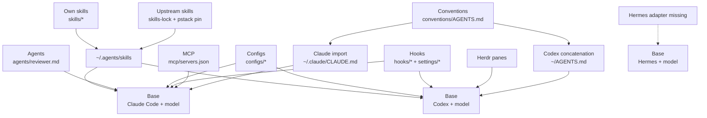

# Declutter audit, 2026-09-03

This audit treats the repository as a portable context layer for one operator. The repository remains
the authority for conventions, source provenance, and machine setup (`docs/THESIS.md`,
`MAINTAINING.md`). The recommendations do not authorize deletion. The operator decides each item.

## Principle to tool map

| Principle | Layer | Tool | Fixed or flexible | Repository configuration | Fresh-machine path |
|---|---|---|---|---|---|
| Keep the execution loop in a maintained harness. Treat the harness and model as the base model. | Base | Claude Code and Codex. Hermes is an experiment. | Harness is flexible. | `docs/THESIS.md`, `configs/*.yaml`, `configs/pstack-codex.md` | Install the harness separately. `bootstrap.sh` does not install Claude Code, Codex, or Hermes (`bootstrap.sh`, `docs/INSTALL.md`). |
| Keep plans and execution state in one durable tracker. | Work management | Linear | Fixed. | `mcp/servers.json`, `conventions/AGENTS.md`, `skills/cleanup-crew/SKILL.md` | `bootstrap.sh` runs `install.sh`, which registers Linear only through `claude mcp add` (`install.sh`, `mcp/servers.json`). Add the equivalent Codex and Hermes paths. |
| Give every machine the same remote agent connections without storing tenant data. | Agent connection | Executor Cloud through MCP | Fixed. | `mcp/servers.json` uses `url_env: EXECUTOR_MCP_URL`. | Set `EXECUTOR_MCP_URL`, then run `bootstrap.sh`. The current installer registers it only for Claude Code (`install.sh`). |
| Put implementation agents in observable terminal panes. | Runtime | Herdr | Fixed. | Missing. The scoped Herdr search returned no matches `[measured: rg -n -i 'herdr' . --hidden --glob '!.git/**' --glob '!docs/AUDIT-2026-09-03.md' -> no matches, exit 1]`. | Add `herdrdev/herdr` to `skills-lock.json`. The live machine lock identifies that source, but the committed lock does not (`skills-lock.json`, `bootstrap.sh`). Install the Herdr binary through its upstream installer. |
| Consume procedure design from its authors and keep source history. | Skills method | pstack and Matt Pocock's skills | Fixed. | `pstack-revision.txt`, `skills-lock.json`, `configs/pstack-codex.md` | `bootstrap.sh` checks out pinned pstack, restores the skill lock, and runs `install.sh` (`bootstrap.sh`, `install.sh`). |
| Create runnable worktrees with their package and secret state. | Workspace | `wt`, treehouse, pnpm, and uv | Fixed. | The tools belong in the private layer. This repo contains only `templates/worktree-helper.md`. `docs/CREDITS.md` credits treehouse. | Clone the private layer before `bootstrap.sh` (`docs/INSTALL.md`). Remove the generic template after both skill references move to the private worktree rules (`skills/ship/SKILL.md`, `skills/dogfood-local/SKILL.md`). |
| Load stable working rules in every session. | Conventions | `conventions/AGENTS.md` | Fixed method, editable content. | `conventions/AGENTS.md`, `CLAUDE.md`, `install.sh` | `install.sh` creates a Claude `@import` at `~/.claude/CLAUDE.md`. It concatenates the same source into `~/AGENTS.md` for Codex (`install.sh`). |
| Do not let the author grade the author's diff. | Review | Fresh Sonnet reviewer for Codex-authored diffs, plus standards and spec review | Fixed independence, flexible model only when the preferred lane is unavailable. | `conventions/AGENTS.md`, `agents/reviewer.md`, `configs/*.yaml` | `install.sh` links `agents/reviewer.md` into Claude Code. Change its Opus pin to Sonnet and update the stale config roles (`install.sh`, `agents/reviewer.md`, `configs/README.md`). |
| Declare remote tools once and keep credentials outside Git. | MCP | Context7, Exa, Linear, and Executor | Fixed declaration method. | `mcp/servers.json` | Generate or register entries for each harness. The current code configures Claude Code only (`install.sh`, `mcp/servers.json`). |
| Use event reminders for rules that agents can forget to route. | Hooks | Review reminder and tracker cleanup reminder | Fixed mechanism, advisory behavior. | `hooks/*`, `settings/*` | `install.sh` links the hooks. The operator merges the settings templates (`install.sh`, `docs/INSTALL.md`, `settings/*`). |
| Restore upstream skills from recorded sources and reapply local trigger policy. | Skill sync | `skills-lock.json`, `bin/skills-update`, `scripts/skill_metadata.py` | Fixed. | `skills-lock.json`, `skills-unlock.txt`, `pstack-revision.txt` | Run `bootstrap.sh` once. Use `bin/skills-update` for later updates (`bootstrap.sh`, `bin/skills-update`, `MAINTAINING.md`). |

## Layer diagram



`install.sh` proves the Claude import, Codex concatenation, skill links, agent link, and hook links.
The MCP edge reaches Claude Code only (`install.sh`). The Herdr and Hermes edges do not exist in the
repository. The Herdr absence search is in the evidence table below.

## Inventory and recommendations

### Top-level paths

The inventory follows `git ls-tree --name-only HEAD`. Empty worktree mounts `.agents/` and `.codex/`
are not tracked repository paths.

| Path | Recommendation | Reason and replacement |
|---|---|---|
| `.gitignore` | KEEP | It excludes credentials and local machine state (`.gitignore`). |
| `.python-version` | ASK | It pins Python `3.12.13` `[sourced: .python-version]`, but `docs/INSTALL.md` requires only `python3`. No repository file refers to the pin. Ask whether it is an intentional compatibility requirement. |
| `AGENTS.md` | KEEP | It is the smallest agent entry point. It routes install, explanation, and change work to the correct documents and names the checks (`AGENTS.md`). |
| `CLAUDE.md` | KEEP | Its single `@AGENTS.md` import makes the repository entry available to Claude Code (`CLAUDE.md`). |
| `LICENSE` | KEEP | It is the repository license and is linked from `README.md` and `docs/CREDITS.md` (`LICENSE`, `README.md`, `docs/CREDITS.md`). |
| `MACHINE-NOTES.md` | PRUNE | It declares machine-only state and has no in-repo reference. Move any still-current content to the private layer (`MACHINE-NOTES.md`, `docs/INSTALL.md`). |
| `MAINTAINING.md` | KEEP | It owns contributor procedures, source-link rules, and verification (`MAINTAINING.md`). Remove architecture explanations when `docs/HOW-IT-WORKS.md` already owns them. |
| `NOTICE` | KEEP | `agents/reviewer.md` retains adapted OpenAI material, so the attribution remains live (`NOTICE`, `agents/reviewer.md`). Recheck this decision only if the reviewer prompt is replaced. |
| `README.md` | KEEP | Keep it as a short landing page and document index (`README.md`). Link to the canonical layer diagram instead of maintaining another one after this audit is accepted. |
| `agents/` | KEEP | The reviewer prompt adds adversarial review and evidence requirements that standards review does not provide (`agents/reviewer.md`). Change `model: opus` to Sonnet because Codex authors implementation diffs (`agents/reviewer.md`, `configs/README.md`). |
| `bin/` | KEEP | Keep `bin/skills-update`. Prune `bin/delegate`, which routes Claude-authored work to Codex and caches an obsolete spend-cap state (`bin/delegate`, `bin/skills-update`, `configs/README.md`). Matt's `code-review` already validates the fixed point and uses a three-dot range, while `agents/reviewer.md` supplies the defect lane. |
| `bootstrap.sh` | KEEP | It is the one-command install path (`bootstrap.sh`, `docs/INSTALL.md`). Add Herdr restoration. Fix worktree checkout detection after approval because the current `[ -d "$DEST/.git" ]` test misclassifies this worktree (`bootstrap.sh`, `tests/test_skill_metadata.py`). |
| `configs/` | KEEP | Keep named role choices, but update every stale author and reviewer role (`configs/*.yaml`, `configs/README.md`). See the config findings below. |
| `conventions/` | KEEP | This is the canonical always-loaded method (`conventions/AGENTS.md`, `install.sh`). Other files should link to it instead of copying review and continuation rules. |
| `docs/` | KEEP | Keep one document per purpose. Apply the document decisions below (`README.md`, `docs/*`, `MAINTAINING.md`). |
| `hooks/` | KEEP | Keep both event hooks. Remove the Codex interception and `delegate` copy from `hooks/review_reminder.py`. Keep its pre-push review reminder (`hooks/review_reminder.py`, `hooks/cleanup_crew_after_pr.py`). |
| `install.sh` | KEEP | It is the linker and generated-config boundary (`install.sh`, `MAINTAINING.md`). Add harness-neutral MCP registration and remove Ponytail collision code after the wrapper migration. |
| `mcp/` | KEEP | It contains the required Linear and Executor declarations without a tenant URL (`mcp/servers.json`). Extend consumption beyond Claude Code (`install.sh`). |
| `pstack-revision.txt` | KEEP | Bootstrap and install validate this fixed upstream revision (`pstack-revision.txt`, `bootstrap.sh`, `scripts/skill_metadata.py`). The checkout and file both returned `c2ade4bba14fb4706857286afb5528bc2244bf44` `[measured: git -C /home/ivankoh/.local/share/agent-plugins/pstack-claude rev-parse HEAD; cat pstack-revision.txt -> matching values]`. |
| `scripts/` | KEEP | `bootstrap.sh`, `install.sh`, and `bin/skills-update` call `scripts/skill_metadata.py`. `tests/test_skill_metadata.py` tests it. Remove the Ponytail quarantine branch after a safe migration (`scripts/skill_metadata.py`). |
| `settings/` | KEEP | The installer validates Codex settings, and the install guide requires a manual merge (`install.sh`, `docs/INSTALL.md`, `settings/*`). Remove the Claude Codex plugin entry if Herdr becomes its only use. |
| `skills-lock.json` | KEEP | It records upstream provenance for restoration (`skills-lock.json`, `bootstrap.sh`). Normalize machine state later and add `herdrdev/herdr`. |
| `skills-unlock.txt` | KEEP | It allows skills to invoke selected Matt procedures (`skills-unlock.txt`, `install.sh`, `bin/skills-update`). Re-test each entry after `skills/ship` leaves. |
| `skills/` | KEEP | Keep this directory for procedures owned here. Apply the per-skill decisions below (`skills/*`, `install.sh`). |
| `templates/` | PRUNE | The fixed private `wt` and treehouse path replaces the generic worktree design. Update the measured consumers, then remove `templates/worktree-helper.md` `[measured: rg -n --glob '!templates/**' --glob '!docs/AUDIT-2026-09-03.md' 'templates/|worktree-helper\.md' . -> skills/ship/SKILL.md and skills/dogfood-local/SKILL.md]` (`templates/worktree-helper.md`). |
| `tests/` | KEEP | This is the canonical suite and exercises installer, bootstrap, metadata, and collision behavior (`tests/test_skill_metadata.py`, `AGENTS.md`). Shrink it with the Ponytail code. |

### Documentation files

| Path | Recommendation | Boundary |
|---|---|---|
| `docs/THESIS.md` | KEEP | Own the reason for personal in-context tuning. Remove descriptions of `bin/delegate` and the full `ship` skill after those paths change (`docs/THESIS.md`). |
| `docs/HOW-IT-WORKS.md` | KEEP | Own architecture and runtime flow. Replace the hand-maintained Matt skill list with a link to `skills-lock.json`. Add Herdr, Executor, and Hermes status (`docs/HOW-IT-WORKS.md`, `skills-lock.json`). |
| `docs/GLOSSARY.md` | PRUNE | Its layer and role definitions repeat `docs/HOW-IT-WORKS.md`. Move only terms that the architecture document uses without defining (`docs/GLOSSARY.md`, `docs/HOW-IT-WORKS.md`). |
| `docs/INSTALL.md` | KEEP | Own install, verification, update, and uninstall procedures (`docs/INSTALL.md`). |
| `docs/SYNC.md` | PRUNE | It documents an unimplemented sibling plan for `bin/skills-sync`. Move the desired work to the issue tracker. Keep update steps in `docs/INSTALL.md` and catalog editing in `MAINTAINING.md` (`docs/SYNC.md`). |
| `docs/CREDITS.md` | KEEP | Own upstream source and license attribution. Add Herdr when the catalog adds it (`docs/CREDITS.md`, `skills-lock.json`). |

`README.md`, `docs/THESIS.md`, and `docs/HOW-IT-WORKS.md` all introduce the base-model and thin-harness
idea. Keep one sentence in `README.md`, the argument in `docs/THESIS.md`, and mechanics in
`docs/HOW-IT-WORKS.md`. Keep review policy normative only in `conventions/AGENTS.md`. Let
`configs/README.md`, `agents/reviewer.md`, and `docs/HOW-IT-WORKS.md` map or explain it.

### Skills owned in this repository

| Skill | Recommendation | Judgment |
|---|---|---|
| `skills/cleanup-crew` | KEEP | pstack Babysit handles PR conflicts, review threads, and CI. It does not enumerate tracker states, repair orphan projects, verify stale premises, or distinguish cancellation from completion. Those Linear operations remain specific and live through `hooks/cleanup_crew_after_pr.py` (`skills/cleanup-crew/SKILL.md`, `hooks/cleanup_crew_after_pr.py`, `conventions/AGENTS.md`). |
| `skills/dogfood-local` | MERGE | Keep a thin wrapper around pstack's matching-surface verification. Preserve local rather than production judgment, the multi-branch integration workspace, frontend and API health, local test-data shaping, and loaded-artifact checks. Remove the `ship` and generic template dependencies (`skills/dogfood-local/SKILL.md`, `skills/ship/SKILL.md`, `templates/worktree-helper.md`). |
| `skills/ponytail` | REPLACE-WITH-UPSTREAM | The local file is an original opt-in wrapper inspired by upstream, not the archived upstream body (`skills/ponytail/SKILL.md`). Keep the named upstream report skills with explicit-use metadata `[measured: jq '[.skills | keys[] | select(startswith("ponytail-"))] | length' skills-lock.json -> 5]`. Use pstack's Laziness Protocol for the main simplification pass, then remove local collision and quarantine code (`skills-lock.json`, `scripts/skill_metadata.py`, `install.sh`, `bin/skills-update`). |
| `skills/ship` | REPLACE-WITH-UPSTREAM | Pstack playbooks cover the work loop. Matt `implement` covers small execution. Matt `wayfinder` covers large decision maps. Matt `code-review` covers fixed-point standards and spec review. Keep two-lane review, milestone comments, caller audits, and continuation rules in `conventions/AGENTS.md`. Remove the 241-line wrapper unless the operator chooses draft PRs `[measured: wc -l skills/ship/SKILL.md -> 241]` (`skills/ship/SKILL.md`, `skills-unlock.txt`). |

### Role, review, and runtime findings

- `configs/lean.yaml` assigns a Haiku implementer. `configs/default.yaml` and `configs/deep.yaml`
  assign Sonnet implementers. These configs contradict the Codex-in-Herdr rule stated in
  `configs/README.md` (`configs/lean.yaml`, `configs/default.yaml`, `configs/deep.yaml`,
  `configs/README.md`).
- The same configs assign Codex reviewers even though Codex authors the implementation diff. Replace
  those reviewers with the fresh Sonnet reviewer (`configs/*.yaml`, `agents/reviewer.md`).
- `configs/deep.yaml` adds an Opus second pass, and `agents/reviewer.md` pins Opus. Both contradict the
  rule that Claude subagents use Sonnet, never Opus (`configs/deep.yaml`, `agents/reviewer.md`,
  `configs/README.md`).
- `configs/single-vendor.yaml` remains coherent only as an explicit no-Claude fallback. It is stale as
  the normal Codex-led path if Sonnet review is available (`configs/single-vendor.yaml`,
  `configs/README.md`).
- `bin/delegate` and the Codex branch of `hooks/review_reminder.py` warn against the expected Codex
  implementation route. Herdr should own pane execution. The Sonnet reviewer should own defects and
  test quality (`bin/delegate`, `hooks/review_reminder.py`, `agents/reviewer.md`).
- The YAML configs are declarations, not executable configuration. The only in-repo references outside
  `configs/` are documentation references in `docs/HOW-IT-WORKS.md`
  `[measured: rg -n --hidden --glob '!.git/**' --glob '!configs/**' --glob '!docs/AUDIT-2026-09-03.md' 'configs/(lean|default|deep|single-vendor)\\.yaml|roles:' . -> docs/HOW-IT-WORKS.md only]`.

### Herdr, Executor, and Hermes gaps

Herdr is installed on this machine but is not reproducible from this branch. The live skill lock names
`herdrdev/herdr` and `skills/herdr/SKILL.md`
`[measured: jq '.skills.herdr' /home/ivankoh/.agents/.skill-lock.json -> source herdrdev/herdr]`.
The committed repo contains no Herdr reference
`[measured: rg -n -i --hidden --glob '!.git/**' --glob '!docs/AUDIT-2026-09-03.md' 'herdr' . -> no matches, exit 1]`.
Add the live source entry to `skills-lock.json`. Make `bootstrap.sh` fail when the fixed Herdr skill is
missing after restoration (`skills-lock.json`, `bootstrap.sh`).

Executor is declared with `url_env` exactly as required (`mcp/servers.json`). The declaration does not
reach Codex because `install.sh` invokes only `claude mcp add`. The live Codex MCP list also lacks
Executor `[measured: codex mcp list -> attio, context7, exa, linear]`. The installed CLI supports
`codex mcp add NAME --url URL` and bearer-token environment variables
`[measured: codex mcp add --help -> --url and --bearer-token-env-var]`. Generate both Claude and Codex
registrations from `mcp/servers.json` (`install.sh`, `mcp/servers.json`).

No Hermes path exists `[measured: rg -n -i 'hermes' . --hidden --glob '!.git/**' --glob '!docs/AUDIT-2026-09-03.md' -> no matches, exit 1]`.
A minimal experimental layer needs these parts:

1. Document the Hermes install and model setup next to the other harness prerequisites
   (`docs/INSTALL.md`). The [official quickstart](https://github.com/NousResearch/hermes-agent/blob/main/website/docs/getting-started/quickstart.md)
   provides the installer and `hermes model` flow.
2. Reuse project `AGENTS.md` rather than add `HERMES.md`. Hermes loads `AGENTS.md` as project context
   when no higher-priority Hermes file exists, according to the
   [official context-file documentation](https://github.com/NousResearch/hermes-agent/blob/main/website/docs/user-guide/features/context-files.md).
3. Expose upstream and own skills from their recorded sources. Do not copy the installed folders
   (`skills-lock.json`, `pstack-revision.txt`, `MAINTAINING.md`).
4. Generate `mcp_servers` entries in `~/.hermes/config.yaml` from `mcp/servers.json`. Hermes reads that
   key at startup, according to the
   [official MCP documentation](https://github.com/NousResearch/hermes-agent/blob/main/skills/autonomous-ai-agents/hermes-agent/references/native-mcp.md).
5. Add a Hermes canary beside the Claude Code and Codex checks (`docs/INSTALL.md`).

Do not use `hermes import-agent claude-code` as the authority without first proving that it preserves
source links. An import that copies skill folders would violate `MAINTAINING.md`.

## Unused and liveness evidence

| Claim | Search and result |
|---|---|
| `MACHINE-NOTES.md` has no in-repo consumer. | `[measured: rg -n --hidden --glob '!.git/**' --glob '!MACHINE-NOTES.md' --glob '!docs/AUDIT-2026-09-03.md' 'MACHINE-NOTES\\.md|Machine notes|claudex|CLAUDE_CODE_ENABLE_CFC' . -> no matches, exit 1]` |
| `.python-version` has no in-repo reference. | `[measured: rg -n --hidden --glob '!.git/**' --glob '!.python-version' --glob '!docs/AUDIT-2026-09-03.md' '\\.python-version|3\\.12\\.13' . -> no matches, exit 1]` |
| The generic worktree template has measured consumers. | `[measured: rg -n --hidden --glob '!.git/**' --glob '!templates/**' --glob '!docs/AUDIT-2026-09-03.md' 'templates/|worktree-helper\\.md' . -> skills/ship/SKILL.md and skills/dogfood-local/SKILL.md]` |
| The planned sync document has a measured consumer, and `bin/skills-sync` does not exist. | `[measured: rg -n --hidden --glob '!.git/**' --glob '!docs/SYNC.md' --glob '!docs/AUDIT-2026-09-03.md' 'docs/SYNC\\.md|Skill sync|bin/skills-sync|planned catalog' . -> README.md only]` |
| Herdr has no committed configuration. | `[measured: rg -n -i --hidden --glob '!.git/**' --glob '!docs/AUDIT-2026-09-03.md' 'herdr' . -> no matches, exit 1]` |
| Hermes has no committed configuration. | `[measured: rg -n -i --hidden --glob '!.git/**' --glob '!docs/AUDIT-2026-09-03.md' 'hermes' . -> no matches, exit 1]` |
| Settings are live. | `MAINTAINING.md`, `docs/INSTALL.md`, and `docs/HOW-IT-WORKS.md` reference `settings/*`. `install.sh` validates the Codex entries. |
| Scripts and tests are live. | `bootstrap.sh`, `install.sh`, and `bin/skills-update` call `scripts/skill_metadata.py`. `tests/test_skill_metadata.py` imports it. |
| MCP declarations are live but Claude-only. | `install.sh` reads `mcp/servers.json` and calls `claude mcp add` (`install.sh`, `mcp/servers.json`). |

The canonical suite is red in this fresh worktree. It ran 40 tests and failed 6
`[measured: python3 -m unittest discover -s tests -> Ran 40 tests; FAILED (failures=6); exit 1]`.
Each failure reaches the fake `git clone` path because `bootstrap.sh` checks whether `.git` is a
directory. A linked worktree uses a `.git` file (`bootstrap.sh`, `tests/test_skill_metadata.py`). This
audit records the defect and does not fix it.

## Fresh-agent onboarding

A fresh agent reads no more than this path:

1. `AGENTS.md` for task routing and required checks.
2. `README.md` for the stack map and document routes.
3. `docs/THESIS.md` for the operator's reason and boundaries.
4. `docs/HOW-IT-WORKS.md` for the layer flow and terms.
5. Read `docs/INSTALL.md` to operate the setup, or `MAINTAINING.md` to change it.

Run one command from a clone:

```bash
./bootstrap.sh
```

To make that path true, move `MACHINE-NOTES.md` to the private layer. Remove `docs/GLOSSARY.md` and
`docs/SYNC.md` after their live content moves. Remove `templates/worktree-helper.md` after its two
callers use the private worktree rule. Replace the hand-maintained skill list in
`docs/HOW-IT-WORKS.md` with `skills-lock.json` (`MACHINE-NOTES.md`, `docs/GLOSSARY.md`, `docs/SYNC.md`,
`templates/worktree-helper.md`, `skills/ship/SKILL.md`, `skills/dogfood-local/SKILL.md`,
`docs/HOW-IT-WORKS.md`).

## Counts before and after pruning

Commit `b1f3600` contains 42 tracked files and 5,121 lines
`[measured: git ls-files before adding this audit; Python splitlines over each listed path -> 42 files, 5121 lines]`.
It contains 4 repo skill entries, 45 catalogued upstream entries, and 52 pinned pstack entries
`[measured: Python over skills/*/SKILL.md, skills-lock.json, and the pinned pstack skills directory -> 4, 45, 52]`.
The two upstream sources contain 97 entries and 94 unique names because `deslop`, `tdd`, and `teach`
overlap `[measured: Python set comparison -> 97 source entries, 94 unique names, 3 overlaps]`.

The whole-path pruning set is `MACHINE-NOTES.md`, `bin/delegate`, `docs/GLOSSARY.md`, `docs/SYNC.md`,
`skills/ponytail/SKILL.md`, `skills/ship/SKILL.md`, and `templates/worktree-helper.md`. That set removes
7 files and 598 lines. The retained corpus has 35 files and 4,523 lines
`[measured: Python over git ls-files excluding the named set -> 7 removed files, 598 removed lines, 35 retained files, 4523 retained lines]`.
If the operator also prunes `.python-version`, the retained corpus has 34 files and 4,522 lines
`[measured: the same command excluding .python-version -> 34 files, 4522 lines]`.

After the skill decisions, this repo owns 2 skills and records 98 upstream source entries after Herdr
joins the catalog. Those upstream entries have 95 unique names
`[measured: current source sets plus herdr, minus local ship and ponytail -> 2 own, 98 upstream source entries, 95 unique upstream names]`.
These retained-line counts measure whole-file pruning only. The thin dogfood merge, config corrections,
Ponytail code removal, Herdr catalog entry, Hermes adapter, and documentation edits will change the
final line count. That final count is unverified until those changes exist.

## ASK items

1. Is `.python-version` an intentional Python compatibility pin? If not, prune it (`.python-version`,
   `docs/INSTALL.md`).
2. Should pull requests open as drafts, as `skills/ship` requires, or ready, as pstack Opening a PR
   requires? Keep a thin local wrapper only for the draft choice (`skills/ship/SKILL.md`).
3. Should `configs/single-vendor.yaml` remain as an explicit no-Claude emergency fallback, or should
   every Codex-authored diff require Sonnet review (`configs/single-vendor.yaml`, `configs/README.md`)?
4. Does any external tool parse `configs/*.yaml`? No in-repo executable does. If the answer is no,
   their schema can change without a compatibility layer (`configs/*.yaml`, `docs/HOW-IT-WORKS.md`).
5. Should the five explicit Ponytail report skills remain installed? If yes, keep them catalog-only
   and remove the local main wrapper (`skills-lock.json`, `skills/ponytail/SKILL.md`).
