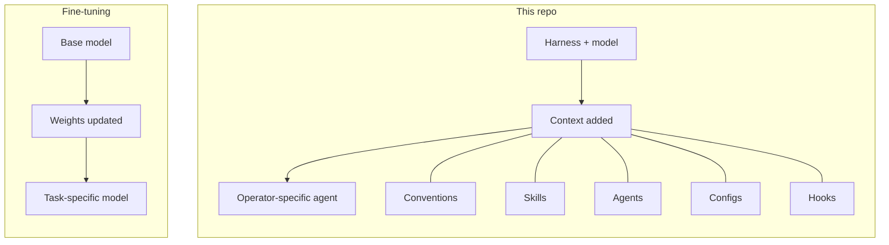
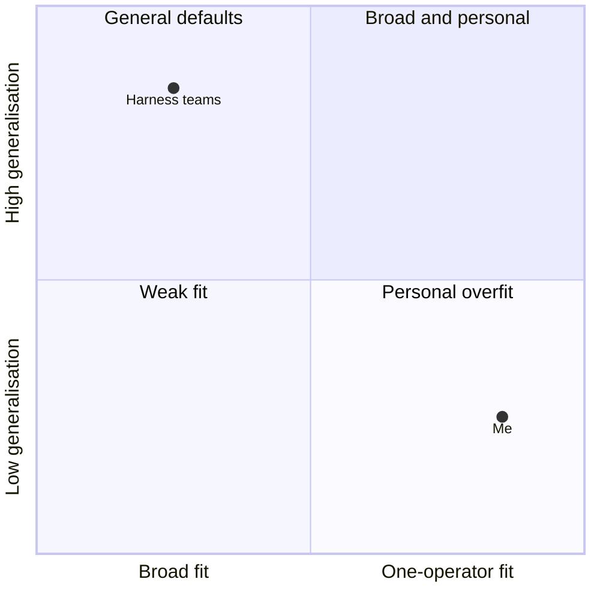
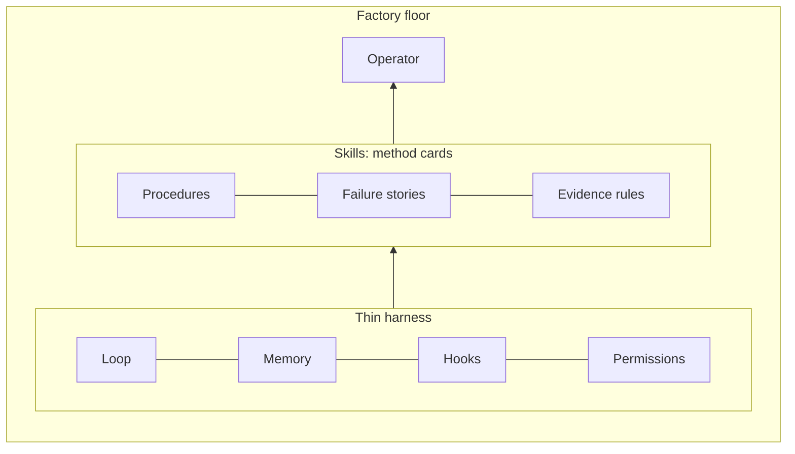
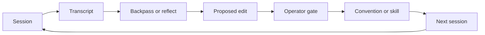
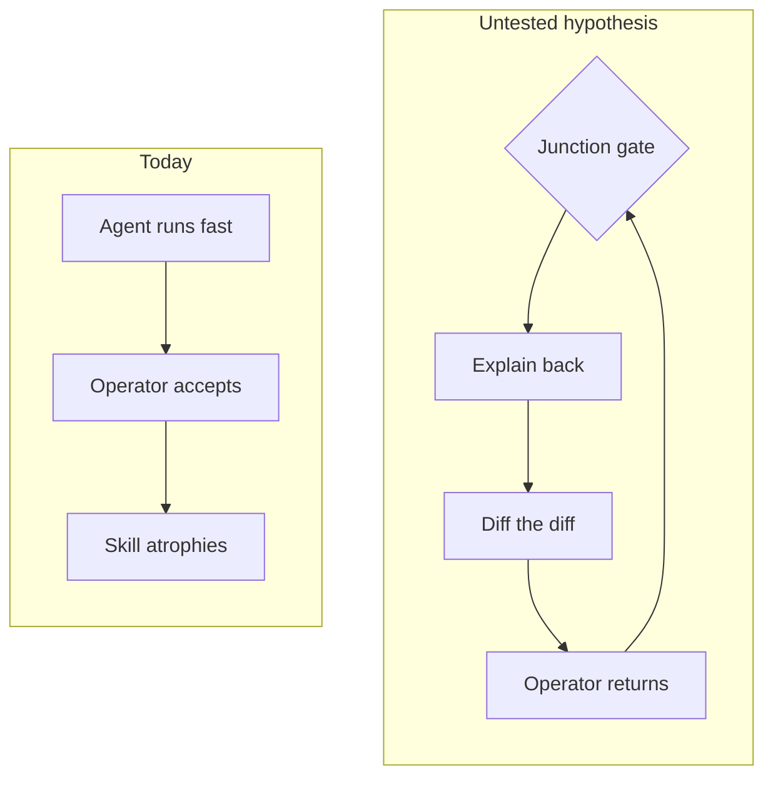
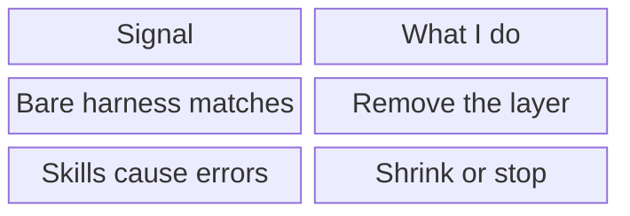

# impstack, imperfect operator.

## The analogy

The right side is a metaphor. Nothing trains, and no weight changes. The analogy helps me think
about in-context learning as a personal fine-tune that I can read and edit.

## Performance vs generalisation

I assume harness teams evaluate across many users and repositories. I can accept less
generalisation because my target distribution is one operator, me.

## Method cards on the factory floor

Garry Tan calls this
["thin harness, fat skills"](https://github.com/garrytan/gbrain/blob/master/docs/ethos/THIN_HARNESS_FAT_SKILLS.md).
I treat skills as method cards on the factory floor, not the factory.

## The correction loop

Kun Chen's [backpass](https://github.com/kunchenguid/backpass) gave me the forward-pass and loss-signal
frame. A transcript can expose a failure. I use the gate to choose the habit I want.

## The thinking-loop problem

I have not tested `impstack`, short for imperfection stack. The hypothesis puts friction at the
junctions where I lose track of the work and accept the agent's answer.

## What would make me stop

These are my falsifiers. I am assuming I can measure them across repeated tasks. A good session
tells me little.
